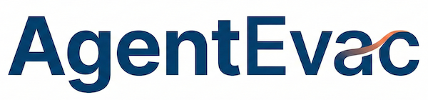

# Agentic Simulator for Wildfire Evacuations



[](https://github.com/denoslab/AgentEvac/actions/workflows/ci.yml)
[](https://github.com/denoslab/AgentEvac/actions/workflows/docker.yml)
[](https://pypi.org/project/agentevac/)
[](https://www.python.org/downloads/)
[](https://denoslab.github.io/AgentEvac/)
[](LICENSE)

📖 **[Full API documentation](https://denoslab.github.io/AgentEvac/)**

An agentic simulator for wildfire evacuations that couples SUMO traffic simulation with LLM-driven agents. Agents follow the Protective Action Decision Model (PADM), maintaining probabilistic beliefs about hazard states and making real-time departure, routing, and destination decisions under uncertainty.

## Background

Wildfire evacuations in the wildland-urban interface (WUI) are high-risk and time-critical. Existing simulations rely on behaviorally naive models that fail to capture dynamic human cognition — fear, trust in authorities, social influence, and evolving risk perception. This project uses LLM agents to encode psychologically grounded, communicative, and adaptive evacuation behavior, enabling rigorous testing of warning strategies and route policies before crises occur.

## Objectives

- Model how information uncertainty ($\sigma_{info}$), communication delays, and social trust ($\theta_{trust}$) affect evacuation decisions
- Compare three information regimes: **no-notice**, **alert-guided**, and **advice-guided** evacuation
- Measure behavioral outcomes (departure timing, route entropy, decision instability) and safety/efficiency trade-offs (hazard exposure vs. travel time)
- Support calibration against historical wildfire after-action reports

## Quickstart

**Requirements:** Python 3.11+, [SUMO](https://sumo.dlr.de/docs/Installing/index.html), OpenAI API key.

```bash
# Install the package and its dependencies
pip install -e .

# Set required environment variables
export SUMO_HOME=/path/to/sumo
export OPENAI_API_KEY=your_key_here

# Run a simulation (interactive, with SUMO GUI)
python -m agentevac.simulation.main --sumo-binary sumo-gui --scenario advice_guided --messaging on

# Run headless with metrics collection
python -m agentevac.simulation.main --sumo-binary sumo --scenario no_notice --metrics on

# Record LLM decisions for deterministic replay
python -m agentevac.simulation.main --run-mode record --scenario alert_guided

# Replay a previous run (no API calls)
python -m agentevac.simulation.main --run-mode replay --run-id 20260209_012156
```

**Scenarios:** `no_notice` | `alert_guided` | `advice_guided`

**Key flags:** `--messaging on/off`, `--events on/off`, `--web-dashboard on/off`, `--overlays on/off`, `--metrics on/off`

## Docker

```bash
# Build the image
docker compose build

# Place scenario files in ./scenario/ (Repaired.sumocfg, *.net.xml, *.rou.xml)
mkdir -p scenario outputs

# Run (OPENAI_API_KEY is read from your shell environment)
docker compose run simulation --scenario advice_guided --metrics on

# Override scenario or flags
docker compose run simulation --scenario no_notice --messaging off --metrics on
```

Run artifacts are written to `./outputs/` on the host.

## Parameter Sweep & Calibration

```bash
agentevac-study \
  --reference reference_metrics.json \
  --sigma-values "20,40,60" \
  --delay-values "0,5" \
  --trust-values "0.3,0.5,0.7" \
  --scenario-values "advice_guided" \
  --sumo-binary sumo
```

This runs a grid search over information noise, delay, and trust parameters and fits results against a reference metrics file.
